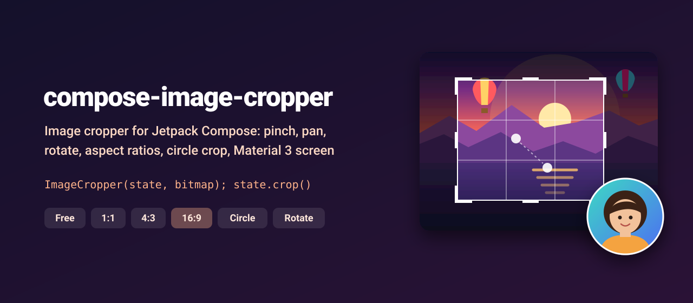
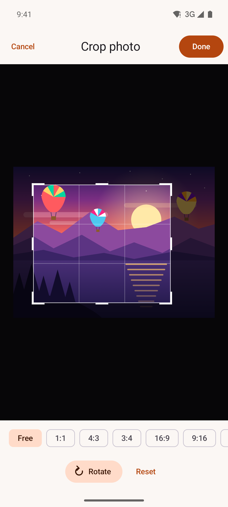
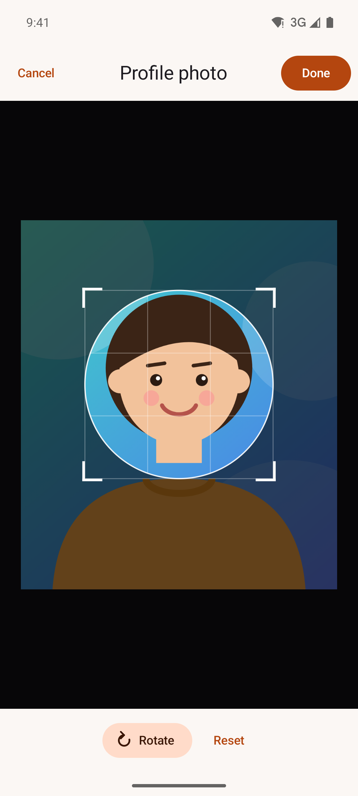
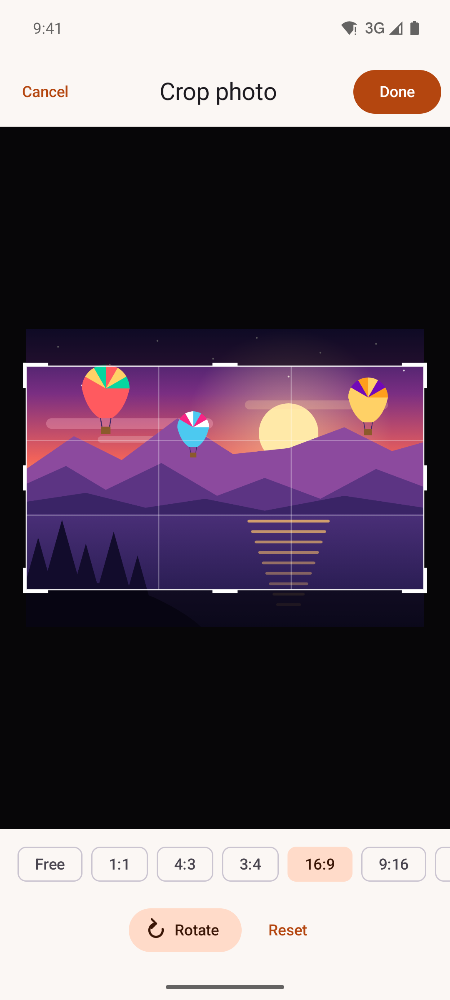
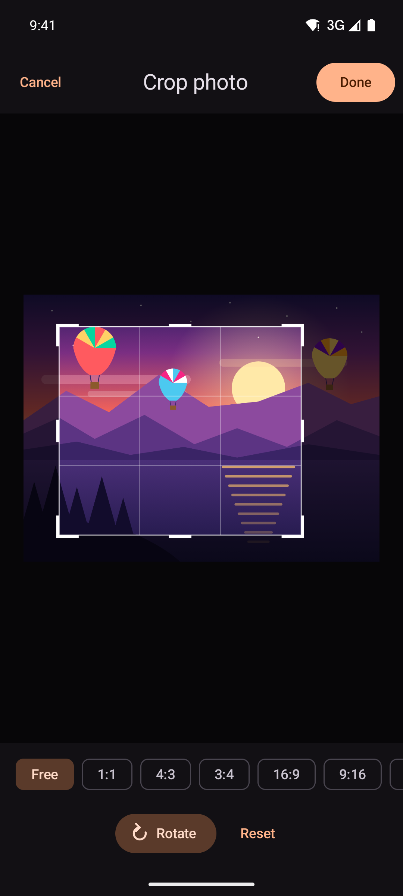

<p align="center">
  
</p>

<p align="center">
  <a href="https://github.com/halilozel1903/compose-image-cropper/actions/workflows/ci.yml"></a>
  <a href="https://jitpack.io/#halilozel1903/compose-image-cropper"></a>
  
  
  
  <a href="LICENSE"></a>
</p>

**compose-image-cropper** is an image cropper for Jetpack Compose. Pinch to zoom, drag to pan, double tap to zoom in, drag the corners and edges of the frame to resize it, lock it to 1:1, 4:3, 16:9 or any ratio, turn the image by 90 degrees and crop to a circle for avatars. Use the `ImageCropper` composable in your own UI, or drop in the ready-made Material 3 `CropScreen`. The crop math lives in a plain Kotlin module with unit tests.

```kotlin
val state = rememberCropState(aspectRatio = AspectRatio.Square)

ImageCropper(state, bitmap, Modifier.fillMaxSize())

Button(onClick = { onCropped(state.crop()) }) { Text("Done") }
```

## Screenshots

Captured from the sample app on an Android emulator by CI.

| Free crop with grid | Circle avatar | 16:9 preset | Dark mode |
| :---: | :---: | :---: | :---: |
|  |  |  |  |

## Why

A cropper has more edge cases than it looks. The image must never leave a gap inside the frame, however you pinch or pan. A locked ratio has to hold while you drag any of eight handles, and the frame must stay on the image and on screen. Rotating should keep the part you framed. And the frame you see in view pixels has to turn into exact source bitmap pixels, through zoom and rotation, at full resolution. compose-image-cropper does all of that and keeps the math in `compose-image-cropper-core`, a pure Kotlin module with 60 unit tests.

## Features

- **`ImageCropper(state, bitmap)`**: the image with a crop frame, a scrim outside it, a rule of thirds grid and corner and edge handles.
- **Pinch to zoom, drag to pan, double tap** to zoom in around the tapped point and again to zoom back out (animated). The image always covers the frame.
- **Draggable handles** on the four corners and four edges, with a minimum size. With a locked ratio, corners resize from the opposite corner and edges grow around the center line.
- **Aspect ratios**: free, 1:1, 4:3, 3:4, 16:9, 9:16, 3:2, 4:5 or any `AspectRatio(w, h)`.
- **Circle crop** for avatars: a 1:1 round frame, and a cropped bitmap with transparent corners.
- **Rotate by 90 degrees** in either direction; the frame stays on the same part of the image.
- **`state.crop(): ImageBitmap`** at the original resolution, or scaled down with `crop(maxSize = 1080)`. `state.sourceRect` gives the source pixels if you want to crop a full size file yourself.
- **`CropScreen`**: a Material 3 screen with Cancel and Done, ratio chips, Rotate and Reset. All texts can be localized.
- **Survives rotation and process death**: the ratio, shape, rotation, zoom and framed region are saved.
- **Pure Kotlin core** (`compose-image-cropper-core`): ratio fitting, handle resizing, zoom and pan clamping, rotation and pixel mapping, unit tested.

## Installation

Add JitPack to `settings.gradle.kts`:

```kotlin
dependencyResolutionManagement {
    repositories {
        google()
        mavenCentral()
        maven("https://jitpack.io")
    }
}
```

Then the dependency:

```kotlin
dependencies {
    implementation("com.github.halilozel1903.compose-image-cropper:compose-image-cropper:1.0.0")
    // Pure Kotlin crop math only (for JVM/KMP modules):
    // implementation("com.github.halilozel1903.compose-image-cropper:compose-image-cropper-core:1.0.0")
}
```

> The build is also set up for Maven Central (`io.github.halilozel1903:compose-image-cropper`) via the vanniktech publish plugin.

## Quick start

**The ready-made screen**

```kotlin
@Composable
fun EditAvatarScreen(photo: ImageBitmap, onDone: (ImageBitmap) -> Unit, onBack: () -> Unit) {
    CropScreen(
        bitmap = photo,
        onCrop = onDone,                                   // the cropped bitmap
        onCancel = onBack,
        state = rememberCropState(shape = CropShape.Circle),
        maxOutputSize = 1024,                              // longest side, 0 keeps the original resolution
        labels = CropScreenLabels(title = stringResource(R.string.profile_photo)),
    )
}
```

**Your own UI**

```kotlin
val state = rememberCropState()
val scope = rememberCoroutineScope()

Column {
    ImageCropper(
        state = state,
        bitmap = photo,
        modifier = Modifier.weight(1f).fillMaxWidth(),
        colors = CropperDefaults.colors(scrim = Color.Black.copy(alpha = 0.7f)),
    )
    Row {
        for (ratio in listOf(null, AspectRatio.Square, AspectRatio.SixteenNine)) {
            FilterChip(
                selected = state.aspectRatio == ratio,
                onClick = { state.aspectRatio = ratio },
                label = { Text(ratio?.toString() ?: "Free") },
            )
        }
        IconButton(onClick = { state.rotateCounterClockwise() }) { /* rotate left icon */ }
        IconButton(onClick = { state.rotateClockwise() }) { /* rotate right icon */ }
    }
    Button(onClick = {
        scope.launch {
            val cropped = withContext(Dispatchers.Default) { state.crop(maxSize = 2048) }
            upload(cropped)
        }
    }) { Text("Save") }
}
```

**Loading a photo**

`crop()` draws the source bitmap with a software canvas, so decode it without hardware bitmaps:

```kotlin
val bitmap = ImageDecoder.decodeBitmap(ImageDecoder.createSource(contentResolver, uri)) { decoder, _, _ ->
    decoder.allocator = ImageDecoder.ALLOCATOR_SOFTWARE
}.asImageBitmap()
```

(Coil: `allowHardware(false)`. On API 24 to 27 use `BitmapFactory`, which decodes to software bitmaps.)

## API

| `CropState` | What it does |
| --- | --- |
| `aspectRatio` | `AspectRatio?`, `null` is free. Setting it lays out the largest frame of that ratio on the image |
| `shape` | `CropShape.Rectangle` or `CropShape.Circle` (always 1:1) |
| `rotation` | `CropRotation.Rotate0` to `Rotate270`, changed with `rotateClockwise()` and `rotateCounterClockwise()` |
| `zoom` | 1 when the whole image fits, up to `maxZoom` (8 by default) |
| `cropRect` / `imageRect` | The frame and the image in the cropper's pixels |
| `cropRegion` | The framed part of the image, normalized to 0..1 |
| `sourceRect` | The framed pixels of the original, unrotated bitmap |
| `setCropRegion(region)` | Frames a normalized region, for example a detected face |
| `zoomBy(factor)`, `reset()` | Zoom about the frame's center; reset rotation, zoom and frame |
| `crop(maxSize = 0)` | The cropped, rotated `ImageBitmap` |

| `ImageCropper` parameter | Default | Meaning |
| --- | --- | --- |
| `colors` | dark scrim, white frame | `CropperDefaults.colors(background, scrim, frame, handles, grid)` |
| `showGrid` | `true` | Rule of thirds grid, brighter while you drag |
| `contentPadding` | 24 dp | Room around the largest frame so handles can be grabbed |
| `contentDescription` | `null` | Describes the image for TalkBack |

## How it works

The image is rotated first, then drawn with a scale and an offset. The frame is a rectangle in view pixels. Every change goes through `CropMath` in the core module:

```text
pinch / pan        -> zoom about the fingers, move, then clamp:
                      scale >= max(frame.width / image.width, frame.height / image.height)
                      offset keeps every side of the image outside the frame
handle drag        -> resize inside (view bounds ∩ image), keep the ratio and the minimum size
rotate             -> turn the framed region with the image, fit the image again
crop()             -> frame in view pixels -> rotated image pixels -> source pixels -> draw rotated
```

```kotlin
val layout = CropMath.layoutForRegion(bounds, imageSize, aspectRatio = 16f / 9f)
val pixels = CropMath.sourceRect(layout.cropRect, layout.transform, PixelSize(4000, 3000), CropRotation.Rotate90)
val frame = CropMath.resize(layout.cropRect, CropHandle.BottomRight, dx = 40f, dy = 10f, bounds, minSize = 96f, aspectRatio = 16f / 9f)
```

## Sample app

The `sample` module opens a sunset landscape (or an illustrated portrait for the avatar crop) in `CropScreen`, and shows the cropped result with its size. Both images are drawn with Compose drawing commands into bitmaps, so there are no image assets and no network.

Pinches and handle drags can't be performed reliably through adb, so the sample sets up screenshot scenes from an intent extra (used by `scripts/screenshots.sh`):

```bash
./gradlew :sample:installDebug
adb shell am start -n io.github.halilozel1903.cropper.sample/.MainActivity --es scene circle
```

`scene` is one of `crop` (a free crop with the grid over part of the landscape), `circle` (the circle avatar crop) or `ratios` (the 16:9 chip selected).

## Project structure

| Module | What it is |
| --- | --- |
| `cropper-core` | Pure Kotlin: ratio fitting, handle resizing, zoom and pan clamping, rotation, mapping the frame to source pixels. Published as `compose-image-cropper-core` |
| `cropper` | Compose: `ImageCropper`, `CropState`, `CropScreen`. Published as `compose-image-cropper` |
| `sample` | A crop screen for a drawn landscape and portrait, with screenshot scenes |

## Tech stack

Kotlin 2.4 · AGP 9.4 with built-in Kotlin · Gradle 9.6 · Jetpack Compose (BOM 2026.09) · Pointer input (`awaitEachGesture`, pinch and pan) · Compose animation · Material 3 · GitHub Actions

## License

MIT. See [LICENSE](LICENSE).
